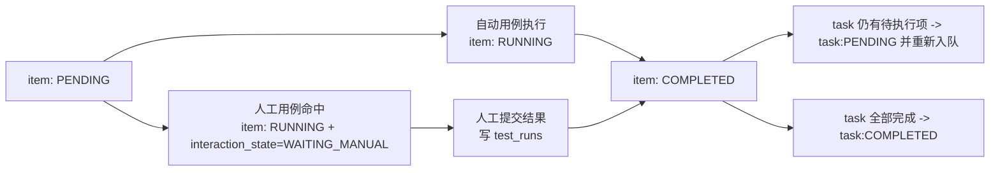

# 人工交互测试最小改动嵌入：初版设计稿

## 1. 现状（基于当前项目）

- 任务调度链路：`execution_tasks` -> `execution_task_items` -> `ExecutionOrchestrator.scheduleExecutionTask()` 串行执行。
- 结果回写链路：每条 item 完成后写入 `test_runs`，再更新 item/task 计数与失败分类。
- 前端主入口：`running` 页任务卡（`src/App.tsx`）+ 详情弹窗（`TaskDetailModal`）。
- 当前状态枚举稳定：
  - 执行状态：`PENDING/RUNNING/COMPLETED/CANCELLED`
  - 测试结果：`PASSED/FAILED/BLOCKED/ERROR`
- 项目已存在 `Manual` 类型用例，但执行器路径仍按自动脚本处理，缺少“人工提交结果并恢复队列”的闭环。

## 2. 设计目标（最小改动）

- 不改现有核心状态枚举（减少全链路改动面）。
- 在 **item 级** 增加“人工交互态”，task 仍沿用 `RUNNING/PENDING/...`。
- 人工步骤出现时，当前 task 暂停在“待人工处理”，**释放 worker**，不阻塞其他任务。
- 人工提交后沿用原有回写逻辑（写 `test_runs`、更新计数、继续后续 item）。

## 3. 最小数据增量

仅新增 `execution_task_items` 字段（推荐）：

- `interaction_state TEXT DEFAULT 'NONE'`
  - 可选值：`NONE | WAITING_MANUAL | IN_MANUAL | SUBMITTED`
- `manual_submission_json TEXT NULL`
  - 记录人工提交内容（结论、执行人、附件等）
- `manual_submitted_at DATETIME NULL`

说明：
- `status/result/failure_category/run_id` 仍使用现有字段，不新增第二套结果字段。
- 人工提交最终仍落在现有 `test_runs`，保证统计、趋势、追溯逻辑不分叉。

## 4. 后端流程设计（嵌入现有 orchestration）

### 4.1 调度到人工用例时

识别条件（二选一）：
- `test_cases.type = 'Manual'`
- 或 `executor_type = 'manual'`（建议新增该 executor 选项）

处理动作：
1. item 置 `status='RUNNING'`, `interaction_state='WAITING_MANUAL'`。
2. task 保持 `status='RUNNING'`，`current_test_case_id/current_item_label` 指向当前人工项。
3. 广播 `EXECUTION_TASK_UPDATED`（可选新增 `EXECUTION_TASK_MANUAL_REQUIRED`）。
4. **结束本次 scheduleExecutionTask()**，让 worker 释放并处理下一个 task。

### 4.2 人工提交后

新增接口：`POST /api/tasks/:taskId/manual-submit`

请求体：
- `item_id`
- `result` (`PASSED/FAILED/BLOCKED/ERROR`)
- `failure_category` (`NONE/ENVIRONMENT/PERMISSION/SCRIPT`)
- `summary`（人工结论）
- `logs`（可选）
- `operator`
- `attachments`（字符串数组，可先存路径/文件名）

服务端动作：
1. 校验该 item 当前 `interaction_state='WAITING_MANUAL'`。
2. 插入 `test_runs`（`executed_by=operator`）。
3. 更新 item：`status='COMPLETED'`, `result`, `failure_category`, `run_id`, `interaction_state='SUBMITTED'`。
4. 更新 task 计数与失败分类（复用现有方法）。
5. 若仍有后续 `PENDING` item：task 置 `PENDING` 并 `enqueue(taskId)`。
6. 若无后续 item：task 置 `COMPLETED`。

## 5. 前端交互初版（文本线框）

### 5.1 Running 页任务卡（最小插入）

```text
[系统安全基线套件] [人工待处理]
进度 18/31 | 当前: BLE认证安全测试 | 通过16 失败1
[详情] [进入人工处理]
```

规则：
- 当 task 下存在 `interaction_state='WAITING_MANUAL'` 的 item 时：
  - 原“取消/重试”旁增加主按钮 `进入人工处理`
  - 状态文案优先显示“人工待处理”

### 5.2 TaskDetailModal 内新增“人工提交区”

```text
执行结论: [PASSED|FAILED|BLOCKED|ERROR]
失败分类: [NONE|ENVIRONMENT|PERMISSION|SCRIPT]
人工结论: [textarea]
证据附件: [上传/列表]
执行人: [input]
[保存草稿] [提交并继续]
```

交互：
- 点击 `提交并继续` -> 调用 `manual-submit`。
- 成功后 toast：`人工结果已提交，任务继续执行`。

### 5.3 移动端（可选 P1）

先不单独开发页面，仅保证 TaskDetailModal 在窄屏可用。

## 6. 状态机（兼容当前枚举）



## 7. 改动清单（按最小实现顺序）

### 7.1 后端

- `backend/db/db-init.ts`
  - 给 `execution_task_items` 增加 3 个字段（`safeExec ALTER TABLE`）。
- `backend/repositories/execution-task-repository.ts`
  - task/detail 查询透出 `interaction_state`。
- `backend/execution/execution-orchestrator.ts`
  - 串行循环中识别人工项并进入 `WAITING_MANUAL` 分支。
  - item 查询建议仅拉 `status='PENDING'` 的后续项，避免重复执行已完成项。
- `backend/routes/tasks.ts`
  - 新增 `POST /api/tasks/:id/manual-submit`。
- `backend/server.ts` / `backend/app/app-factory.ts`
  - 复用现有路由注入，无需新增服务层模块。

### 7.2 前端

- `src/api/client.ts`
  - 增加 `submitManualTaskItem(taskId, body)`。
- `src/api/types.ts`
  - `ExecutionTaskDetailItem` 增加 `interaction_state?`、`manual_submission_json?`。
- `src/App.tsx`
  - running 卡片增加“人工待处理”识别和 CTA。
- `src/modules/task-detail/task-detail-modal.tsx`
  - 加人工提交表单区（仅在 `WAITING_MANUAL` item 上显示）。

## 8. 兼容与风险

- 兼容：不改现有状态枚举和统计口径，历史数据无需迁移脚本。
- 风险：
  - 如果不限制重复提交，可能产生多个 run；需后端校验 `interaction_state` 幂等。
  - 附件上传先走“文件名/路径占位”可快速上线，真实文件存储可放 P1。

## 9. 你这版可以先做的 MVP

- 只实现：
  - `interaction_state` 字段
  - `manual-submit` 接口
  - TaskDetailModal 人工提交区
  - Running 卡片“进入人工处理”按钮
- 暂不做：
  - 草稿保存
  - 多人领取锁
  - 附件对象存储

